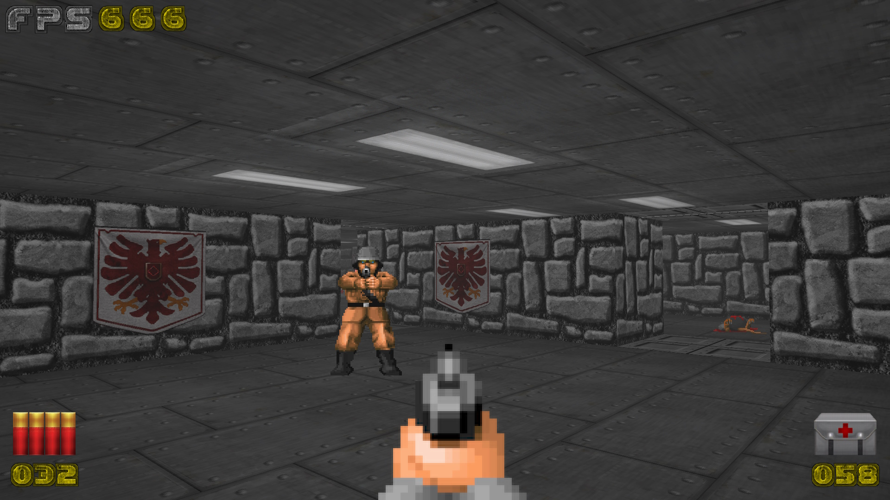
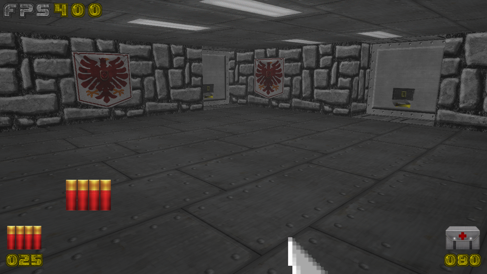
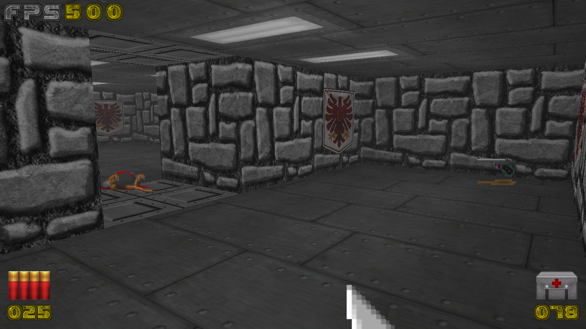
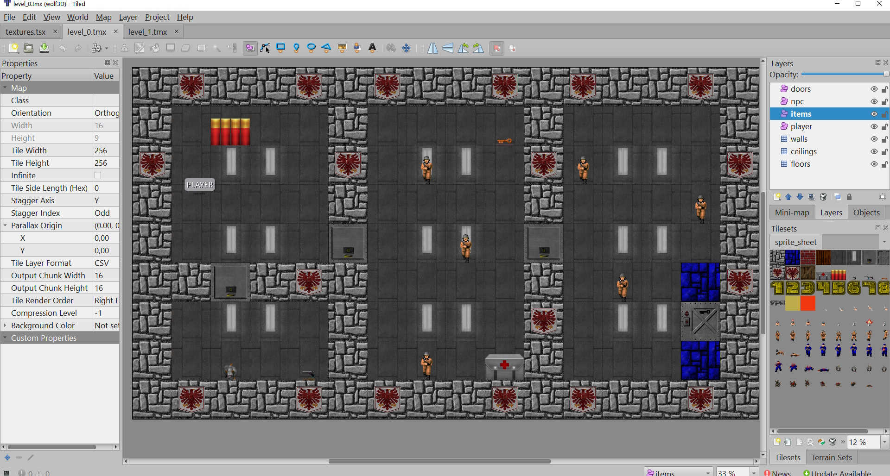

# 🐺 Wolfenstein-3D (Modern OpenGL Edition)

<div align="center">


</div>


[](https://github.com/ShivamKR12/Wolfenstein-3D/actions/workflows/build.yml)

A simple 3D first-person shooter inspired by the classic **Wolfenstein 3D** — built with **Pygame** and **ModernGL**.

This project demonstrates:

* Ray casting–based shooting & visibility
* Grid-based pathfinding (BFS)
* Instanced rendering (doors, NPCs, HUD, items)
* Texture arrays & sprite sheets
* Basic enemy AI
* Level loading from Tiled `.tmx` maps
* Sound system with multiple channels

---

## 📸 Features

### 🎮 Core Gameplay

* First-person movement (WASD + mouse look)
* Weapon switching (Knife, Pistol, Rifle)
* Ammo & health system
* Key-based level progression
* Enemy AI with attack & chase logic
* Item pickups (ammo, medkits, weapons, keys)

### 🧠 Technical Highlights

* OpenGL 3.3 Core Profile
* Texture arrays for performance
* Instanced rendering for billboards & HUD
* Grid-based collision detection
* BFS Pathfinding for NPC navigation
* Ray casting for hit detection
* Modular engine architecture

---

## Screenshots

Here are a few screenshots from the game:






---

## 🗂 Project Structure

```
Wolfenstein-3D/
├── .github/
│   └── workflows/
│       └── build.yml
├── assets/
│   ├── sounds/
│   │   └── *.ogg
│   ├── sprite_sheet/
│   │   ├── sprite_sheet.png
│   │   └── sprite_sheet.txt
│   ├── texture_array/
│   │   ├── texture_array.png
│   │   └── texture_array.txt
│   └── *.png
├── game_objects/
│   ├── door.py
│   ├── game_object.py
│   ├── hud.py
│   ├── item.py
│   ├── npc.py
│   └── weapon.py
├── meshes/
│   ├── base_mesh.py
│   ├── instanced_quad_mesh.py
│   ├── level_mesh.py
│   ├── level_mesh_builder.py
│   ├── quad_mesh.py
│   └── weapon_mesh.py
├── resources/
│   └── levels/
│       ├── level_0.tmx
│       ├── level_1.tmx
│       └── textures.tsx
├── screenshots/
│   ├── 0.jpg
│   ├── 1.png
│   ├── 2.png
│   └── 4.jpg
├── shaders/
│   ├── instanced_billboard.frag
│   ├── instanced_billboard.vert
│   ├── instanced_door.frag
│   ├── instanced_door.vert
│   ├── instanced_hud.frag
│   ├── instanced_hud.vert
│   ├── level.frag
│   ├── level.vert
│   ├── weapon.frag
│   └── weapon.vert
├── .gitignore
├── camera.py
├── engine.py
├── level_map.py
├── main.py
├── path_finding.py
├── player.py
├── ray_casting.py
├── README.md
├── requirements.txt
├── scene.py
├── settings.py
├── shader_program.py
├── sound.py
├── texture_builder.py
├── texture_id.py
├── textures.py
├── utils.py
└── Wolfenstein-3D.spec
```

---

## 🛠 Requirements

* Python 3.9+
* Pygame
* ModernGL
* PyGLM
* pytmx

Install dependencies:

```bash
pip install pygame moderngl PyGLM pytmx
```

---

## ▶️ Running the Game

```bash
python main.py
```

Make sure the following directories exist:

```
assets/
resources/levels/
shaders/
```

---

## 🎮 Controls

| Action          | Key         |
| --------------- | ----------- |
| Move Forward    | W           |
| Move Backward   | S           |
| Strafe Left     | A           |
| Strafe Right    | D           |
| Interact (Door) | F           |
| Switch Weapon   | 1 / 2 / 3   |
| Shoot           | Left Mouse  |
| Change Weapon   | Mouse Wheel |
| Quit            | ESC         |

Mouse is captured automatically.

---

## 🧱 Levels

Levels are built using **Tiled Map Editor** and exported as `.tmx`.

Each level includes:

* `walls`
* `floors`
* `ceilings`
* `doors`
* `items`
* `npc`
* `player`

Levels are loaded dynamically:

```python
level_{num}.tmx
```

---

## 🧠 Architecture Overview

### 🔹 Engine

The `Engine` class connects:

* Player
* Scene
* Shader system
* Level map
* Pathfinding
* Ray casting
* Sound
* Textures

### 🔹 Rendering

Rendering is split into:

* Static level mesh
* Instanced doors
* Instanced billboards (NPCs, items)
* HUD layer
* Weapon mesh (first-person view)

### 🔹 Ray Casting

Used for:

* Player → NPC hit detection
* NPC → Player line-of-sight checks

Implements voxel stepping algorithm.

### 🔹 Pathfinding

* BFS on a grid
* Avoids walls and active NPC tiles
* Cached results using `lru_cache`

---

## 🔫 Weapons

| Weapon | Ammo Use | Damage | Range  |
| ------ | -------- | ------ | ------ |
| Knife  | 0        | 8      | Short  |
| Pistol | 1        | 20     | Medium |
| Rifle  | 2        | 41     | Long   |

Each weapon has:

* Animation frames
* Miss probability
* Sound effects
* Independent texture IDs

---

## 👾 Enemies

NPCs:

* Brown Soldier
* Blue Soldier
* Rat

Each enemy type has:

* Walk / attack / hurt / death animations
* Unique stats
* Attack distance
* Drop items
* Sound effects

---

## 🔊 Audio

Powered by Pygame mixer:

* Background music loop
* Weapon sounds
* NPC attack & death sounds
* Pickup effects
* Door sounds

Multi-channel playback supported.

---

## 🎨 Textures

* Built automatically into:

  * Texture array
  * Sprite sheet
* Located in:

```
assets/textures/
```

Texture IDs managed via `texture_id.py`.

---

## 📈 HUD

Displays:

* Health
* Ammo
* FPS counter
* Screen effects (damage flash)

Rendered using instanced quads.

---

## 🧪 Performance Notes

* Uses instanced rendering for scalability
* Texture arrays reduce draw calls
* Mipmaps + anisotropic filtering enabled
* Depth testing & blending configured

---

## 🚀 Future Improvements

* More enemy types
* More levels
* Saving system
* Advanced AI states
* Dynamic lighting
* Multiplayer support

---

## 📜 License

This project is for educational purposes and inspired by classic FPS design.

---

## 👤 Author

Built as a learning project combining:

* OpenGL rendering
* Game engine architecture
* AI basics
* Real-time input handling
